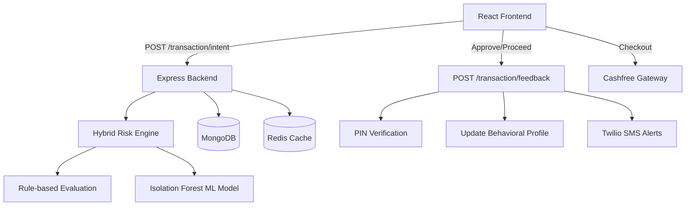

# PROJECT ARCHITECTURE AND TECHNICAL DOCUMENTATION

## 1. Phase 1 — Repository Discovery

The project is structured as a monorepo containing a full-stack web application.

**Key Directories and Files:**
- `/frontend`: The client-side application.
  - `src/main.tsx` & `src/App.tsx`: React application entry points.
  - `src/components/`: Contains UI components like `PaymentFlow.tsx`, `TransactionHistory.tsx`, `RiskCards.tsx`.
  - `src/state/`: Zustand state management (`appStore.ts`, `authStore.ts`, `transactionStore.ts`).
  - `src/api/`: Frontend API wrappers (e.g., `cashfreeApi.ts`, `transactionApi.ts`).
  - `package.json`: Vite, React 18, TailwindCSS, Radix UI, Framer Motion.
- `/backend`: The server-side application.
  - `src/server.js`: Express application entry point.
  - `src/routes/`: API controllers (`transaction.js`, `auth.js`, `cashfree.js`, `nominee.js`).
  - `src/services/`: Business logic (`riskEngine.js`, `behavioralProfile.js`, `pinVerification.js`).
  - `src/ml/`: Machine learning models (`model.js` - Isolation Forest).
  - `src/models/`: MongoDB Mongoose schemas (`User.js`, `Transaction.js`, `PayeeRelationship.js`).
  - `src/utils/`: Utilities like Redis connection (`redis.js`).
  - `package.json`: Express, Mongoose, Redis, Twilio.

## 2. Phase 2 — Project Identity

**Project Name:** DeepBlue4 / Saarthi AI (the repo is DeepBlue4, while the product branding and UI language still reference Saarthi AI).
**Primary Purpose:** A Real-Time Intelligent UPI Fraud Prevention System.
**Problem Solved:** Detects and prevents UPI payment fraud by analyzing user behavior, transaction context, and payee history before authorizing the transaction.

### Runtime verification status
As of the current live run on 2026-09-25, the backend health endpoint reports:

```json
{"status":"OK","timestamp":"2026-09-25T10:52:45.593Z","mongodb":"connected"}
```

This confirms the MongoDB connection is active in the running application.

### Stated Purpose vs. Implemented Purpose
**Stated:** Real-time fraud detection using hybrid AI (Rule-based + ML).
**Implemented:** Mostly implemented and functionally active. The risk engine combines a 6-category rule-based system with ML anomaly detection, and the app includes trusted contact (nominee) messaging and Cashfree payment flow. The code is production-demo oriented rather than a full enterprise security stack.

## 3. Phase 3 — Technology Discovery

The technologies verified by actual implementation are:

**Frontend:**
- **React (v18) & Vite:** Core application framework and build tool.
- **Tailwind CSS & Radix UI:** Styling and accessible UI primitives.
- **Framer Motion:** Used heavily for complex UI animations (e.g., `IntelligentBackground.tsx`, risk meters).
- **Zustand:** Global state management across the payment flow.

**Backend:**
- **Node.js & Express.js:** API server handling requests.
- **MongoDB (Mongoose):** Primary database for storing Users, Transactions, and PayeeRelationships.
- **Redis:** Used for tracking transaction velocity counters and enforcing time delays on HIGH-risk transactions; it is optional at runtime and the server gracefully continues without it if unavailable (`backend/src/utils/redis.js`).
- **Twilio:** Dependency present for optional SMS alerts to trusted contacts; if credentials are missing, SMS is skipped gracefully.
- **Custom PIN system:** The app does not use JWT for transaction auth. Instead, it stores a 4-digit PIN hash and verifies it through `pinVerification.js` for approval flows.

**External Systems:**
- **Cashfree Payments:** Integrated on the frontend for rendering the payment gateway popup and polling the order status; credentials are loaded from environment variables in the backend service layer.

## 4. Phase 4 — Entry Points

1. **Frontend UI Entry Point:** `frontend/src/main.tsx` mounts `App.tsx` which orchestrates `BootSequence`, `AuthPage`, and the `HomePage`.
2. **Backend API Entry Point:** `backend/src/server.js` listens on port 3000 (default) and connects to MongoDB and Redis.
   - Core API Route: `POST /transaction/intent` - triggers the risk engine.

## 5. Phase 5 — System Architecture

The architecture follows a Client-Server model with an integrated machine learning inference step in the backend request lifecycle.



## 6. Phase 6 — End-to-End Workflows

### Transaction & Risk Evaluation Workflow
1. **Trigger:** User initiates payment in the frontend (`PaymentFlow.tsx`).
2. **Intent API:** Frontend sends amount, payee, intent type, and behavioral signals (e.g., hesitation, edits) to `POST /transaction/intent`.
3. **Risk Analysis:** `riskEngine.js` processes the data:
   - Evaluates 6 rule-based categories (payee risk, amount, time/urgency, intent, hesitation, vulnerability).
   - Generates an ML anomaly score using `IsolationForest`.
   - Combines scores to return a risk level: `LOW`, `MEDIUM`, or `HIGH` along with an action (`ALLOW`, `WARN`, `DELAY`).
4. **Delay/Alerts:** If HIGH, a delay state is stored in Redis. A fire-and-forget SMS alert is sent to a trusted contact (nominee).
5. **Feedback & Auth:** Frontend prompts user to confirm the transaction. If confirmed, user enters PIN.
6. **Payment Execution:** Frontend calls Cashfree SDK to render the payment popup, then polls the status until `SUCCESS` or `FAILED`.

## 7. Phase 7 — Storage and Data Architecture

**MongoDB Collections:**
- **Users:** Stores identity, maturity level, behavioral profile (baselines using EMA), and transaction statistics.
- **Transactions:** Stores individual transaction logs, risk decisions, reason codes, ML scores, and behavioral signals captured at the time.
- **PayeeRelationships:** Stores aggregated statistics between a user and a payee (total amount, success rate, trust score, first seen date) without duplicating raw logs.

## 8. Phase 8 — Interfaces and Communication

- **Frontend-Backend API:** RESTful JSON API.
- **Cashfree Interface:** The backend creates an order (`/cashfree/createOrder`), returning an order ID to the frontend. The frontend uses the Cashfree JavaScript SDK to launch the modal and polls the backend (`/cashfree/orderStatus`).

## 9. Phase 9 — Application / Business Logic

**Hybrid Risk Engine (`riskEngine.js`):**
- **Rule-based (60% weight):**
  - *Payee:* Checks if payee is new or has a low trust score.
  - *Amount:* Checks absolute thresholds and deviations from the user's historical average.
  - *Urgency:* Late-night transactions or rapid velocity.
  - *Intent:* Mismatched intent (e.g., "refund" to a new payee).
  - *Hesitation:* User edits or delays captured from the UI.
  - *Vulnerability:* Amplifies risk for new users or large amounts.
- **ML Anomaly (40% weight):**
  - Analyzes the feature vector using an `IsolationForest` model to detect outliers.

## 10. Phase 10 — Security

- **Authentication model:** The actual implementation is a lightweight demo-auth flow rather than full JWT-based auth. The frontend calls `/auth/login` and `/auth/register`, and the backend validates the presence of a user and stores a hashed 4-digit PIN. There is no JWT dependency in the project package list.
- **Transaction Authorization:** A custom PIN verification system validates transactions (`pinVerification.js`). This is the real approval gate used for “PROCEEDED” actions.
- **Rate Limiting/Cooling Off:** Redis is used for velocity tracking and delay enforcement for HIGH-risk transactions when available; otherwise the app continues in degraded mode without breaking the user flow.
- **Sensitive configuration:** Twilio, Cashfree, and MongoDB credentials are expected in environment variables and are not hardcoded into the app logic.

## 11. Phase 11 — Documentation vs Implementation

| Area | Documentation | Implementation | Status |
| ---- | ------------- | -------------- | ------ |
| ML Engine | Mentions Isolation Forest | `model.js` implements Isolation Forest | IMPLEMENTED |
| Trusted Contacts | SMS alerts for high-risk | `nomineeAlert.js` triggers on HIGH risk | IMPLEMENTED |
| Redis | Marked "Optional" | `redis.js` degrades gracefully if missing | IMPLEMENTED |

## 12. Implementation Status Summary

| Component / Feature | Location | Purpose | Status | Evidence |
| ------------------- | -------- | ------- | ------ | -------- |
| Hybrid Risk Engine | `backend/src/services/riskEngine.js` | Evaluates transaction risk | IMPLEMENTED | Contains complex rule logic and ML integration |
| Behavioral Profiling | `backend/src/models/User.js` | Tracks EMA baselines for user | IMPLEMENTED | `updateTransactionStats` and EMA logic present |
| Cashfree Integration | `frontend/src/components/PaymentFlow.tsx` | Executes real payment | IMPLEMENTED | SDK initialization and polling logic present |
| Twilio Alerts | `backend/src/routes/transaction.js` | SMS to Trusted Contact | IMPLEMENTED (optional) | `sendNomineeAlert` is invoked when nominated contact is configured and Twilio credentials are available |
| Delay Enforcement | `backend/src/utils/redis.js` | Time delay for HIGH risk | IMPLEMENTED (graceful fallback) | Uses `setDelayState` in Redis when Redis is online; otherwise the app continues without it |
| Demo Authentication | `backend/src/routes/auth.js` | User register/login flow | IMPLEMENTED | Uses email/user_id and hashed 4-digit PIN, not JWT |

## 13. Final Project Overview

### What the project actually contains
A fully functional, sophisticated full-stack application that implements a multi-layered fraud prevention system for UPI transactions. It features a rich React frontend and a Node.js backend with MongoDB and Redis.

### How the project actually works
When a user initiates a transaction, the frontend captures not just the amount and payee, but also behavioral signals like typing hesitation. The backend merges this with historical aggregated data (from MongoDB) to run a Hybrid Risk Engine. If the transaction is deemed highly risky, the system enforces a delay, alerts a trusted contact, and requires explicit PIN confirmation before launching a Cashfree payment gateway.

### Important technical observations
- The architecture is highly defensive. Redis degrades gracefully if unavailable, and the risk engine falls back to rule-based reasoning when ML-dependent inputs are not available.
- The system heavily relies on client-side behavioral metrics (hesitation, edits, confirmation timing) sent over the API.
- Payee relationships are stored as aggregated statistics rather than querying raw transaction history on every request, which is an optimization for real-time risk scoring.
- This is a strong demo/prototype implementation rather than a full enterprise-grade security platform: authentication is simplified, integration points are sandbox-oriented, and the app depends on local environment setup for MongoDB, Redis, and external APIs.

### Repository evidence
- **Risk Engine:** [`riskEngine.js`](file:///backend/src/services/riskEngine.js)
- **ML Model:** [`model.js`](file:///backend/src/ml/model.js)
- **Payment Flow:** [`PaymentFlow.tsx`](file:///frontend/src/components/PaymentFlow.tsx)
- **Data Models:** [`Transaction.js`](file:///backend/src/models/Transaction.js), [`User.js`](file:///backend/src/models/User.js), [`PayeeRelationship.js`](file:///backend/src/models/PayeeRelationship.js)
